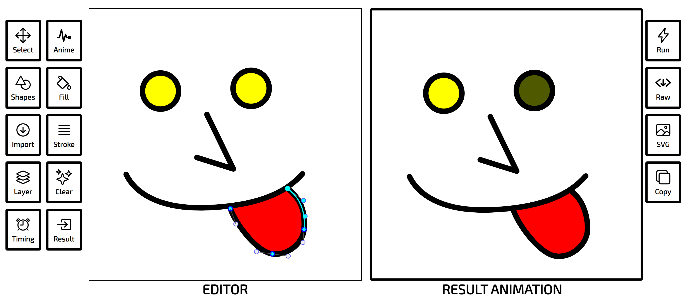

# SVG-Animator
Tool to animate svg images for Web developement, [link to the public site](https://svg-animator.vercel.app/)

You can create your own svg element or import existing iamges your with the edior. 
Animate them, using different animation types and scheduling tools in the UI.
And finally export them as SVG, HTML , or React component files.



So far the site supports : 
- Color Animation
- Dash Animation
- Line Fill Animation
- Path Follow Animation
- Morph Animation


## dependencies

```
node.js yarn
```

## run app 
```
cd web-app
yarn
yarn dev
```
